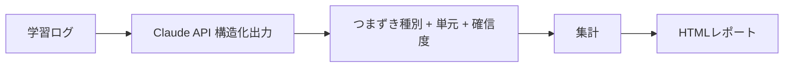

:::message
この記事は、Claude Codeを執筆支援に使った "毎朝1本書く" 取り組みの一環で書いています。

- 目的: 自分のAI活用キャッチアップ。仕組み自体も毎月アップデートしていきます
- 体制: 題材選定・実装・下書きをClaude Codeで補助、Liatrisが動作確認と編集を経て公開判断
- 方針: Zennのガイドラインに真摯に向き合い、運営から指摘や警告があれば即座に取り組みを停止します

仕組みの全貌は[こちらの設計記事](https://zenn.dev/liatris/articles/20260701-zenn-kickoff)にまとめています。
:::

<!-- Day 1 時点: 構成案レベルの下書き。コード・具体実装は Day 2 で書く。 -->

## リード(構成案)

学習系サービスの受講ログ(小テストの正誤、提出物への質問コメント、進捗メモ等)は、
「どこでつまずいたか」の情報を大量に含んでいるが、大半はテキストのまま溜まって
可視化されずに終わる。ここを Claude API の構造化出力でパースし、つまずきパターンを
検出・集計するところまでを実装する。

## アーキテクチャ(構成案)

- 入力: 学習ログ(小テスト結果 + 自由記述コメント)のサンプルデータ(合成データ、実データは使わない)
- Claude API: 構造化出力(tool use / JSON Schema)で「つまずき種別」「該当単元」「確信度」を抽出
- 集計: 単元別・種別別に集計し、つまずきが集中している箇所を可視化
- 出力: 静的な HTML レポート(または簡易ダッシュボード)

## 実装ステップ(構成案、Day 2 で実装)

1. 合成学習ログデータの用意(個人情報を含まない、自作のダミーデータ)
2. 抽出スキーマの設計(つまずき種別の分類軸をどう定義するか)
3. Claude API 呼び出し(構造化出力、バッチ処理)
4. 集計・可視化ロジック
5. 静的レポート生成

## 思考プロセス(構成案)

- 分類軸を固定カテゴリにするか自由記述にするかで悩みそう(固定だと粒度が粗くなる、自由記述だと集計しづらい)→ Day 2 で実際に試して比較する
- 1件ずつ API を呼ぶか、バッチでまとめて渡すかはコストとレイテンシのトレードオフになりそう

## データアナリスト視点(構成案、必須セクション)

- 自由記述ログを構造化データに変換してから集計する、という流れは分析業務の前処理と同じ構造
- 「つまずきの集中箇所」を可視化する発想は、異常検知やファネル分析の考え方に近い

## 成果物(Day 3 で追記)

- GitHub リポジトリ + スクリーンショット(Day 3 で用意)

---

**実装規模**: S(数時間)
**成果物タイプ**: Python script + 静的 HTML レポート
