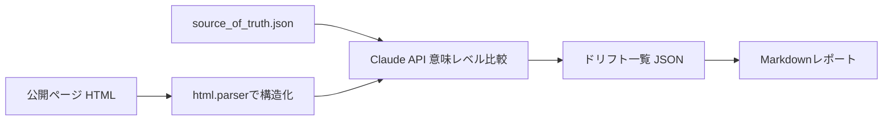

:::message
この記事は、Claude Codeを執筆支援に使った "毎朝1本書く" 取り組みの一環で書いています。

- 目的: 自分のAI活用キャッチアップ。仕組み自体も毎月アップデートしていきます
- 体制: 題材選定・実装・下書きをClaude Codeで補助、平野が動作確認と編集を経て公開判断
- 方針: Zennのガイドラインに真摯に向き合い、運営から指摘や警告があれば即座に取り組みを停止します

仕組みの全貌は[こちらの設計記事](https://zenn.dev/liatris/articles/20260701-zenn-kickoff)にまとめています。
:::

公開しているページの内容と、手元で管理している source of truth データは、更新を人力で反映する運用にしている限りいつかは必ずずれる。厄介なのは、そのずれに気づく手段が「誰かがたまたま見つける」以外に用意されていないケースが多いことだ。古い価格や、消えたはずの機能の記載がそのまま外に出続ける。今回は、このずれを自動で検知する仕組みを Claude API を使って実装した。

## アーキテクチャ

- 入力: source of truth データ(構造化 JSON)と公開ページ(HTML)
- 抽出: 公開ページ側は `html.parser` で source of truth と同じ形の構造化データに変換する
- 判定: 両方を Claude に渡し、「意味として食い違っている項目」だけを JSON で抽出させる
- 出力: Markdown の差分レポート(食い違いがあれば exit code 1 で終了し、CI 組み込みも想定)



## 実装: なぜ単純な diff にしなかったか

最初は普通のテキスト diff で十分だろうと考えていた。しかしサンプルデータを作って試すと、「メールサポート」と「メールでのサポート」のような表記ゆれまで差分として拾ってしまい、本当に見てほしい価格の相違や機能の欠落がその中に埋もれた。意味が同じ表現はスキップし、数値の相違や項目の有無といった意味的な食い違いだけを報告させる必要があった。

公開ページの抽出は依存を増やしたくなかったので、`BeautifulSoup` 等は使わず `html.parser` を直接使っている。

```python:extractor.py
def extract_plans(html: str) -> list[dict]:
    """公開ページ HTML から plan の構造化リストを抽出する。"""
    parser = _PlanSectionParser()
    parser.feed(html)
    return parser.plans
```

Claude には「無視してよいもの」と「報告すべきもの」を明示したシステムプロンプトを渡し、出力を JSON 配列だけに絞っている。

```python:diff_engine.py
SYSTEM_PROMPT = """\
あなたは公開ページと社内マスタデータの整合性をチェックするアシスタントです。
2つの JSON (source_of_truth と published) を比較し、意味的に食い違っている箇所だけを
報告してください。

無視してよいもの:
- 表記ゆれ(全角/半角、敬語の言い回し、語順の違いなど意味が同じもの)
- 出力の都合による軽微なフォーマット差

報告すべきもの:
- 数値の相違(価格、席数など)
- 一方にしか存在しない項目(機能の欠落・追加)
- 意味そのものが変わっている記述

出力は次の JSON 配列のみを返してください(説明文やコードフェンスは不要):
[
  {
    "plan_id": "対象プランのid",
    "field": "対象フィールド名 (price / seats / features / name など)",
    "source_value": "source_of_truth 側の値",
    "published_value": "published 側の値",
    "severity": "high | medium",
    "reason": "なぜドリフトと判断したかの一文"
  }
]
食い違いが無ければ空配列 [] を返してください。
"""


def detect_drift(source_of_truth: list[dict], published: list[dict]) -> list[dict]:
    """Claude API を呼び出し、意味レベルのドリフト一覧を返す。"""
    client = anthropic.Anthropic()

    user_content = (
        "source_of_truth:\n"
        f"{json.dumps(source_of_truth, ensure_ascii=False, indent=2)}\n\n"
        "published:\n"
        f"{json.dumps(published, ensure_ascii=False, indent=2)}"
    )

    response = client.messages.create(
        model=MODEL,
        max_tokens=2048,
        system=SYSTEM_PROMPT,
        messages=[{"role": "user", "content": user_content}],
    )

    raw_text = "".join(
        block.text for block in response.content if block.type == "text"
    )
    return json.loads(_extract_json_array(raw_text))
```

CLI 本体は source と published を読み込んで `detect_drift` に渡すだけ。

```bash
python3 drift_check.py \
  --source sample_data/source_of_truth.json \
  --published sample_data/published_page.html
```

このプロジェクトを組んでいた環境には `ANTHROPIC_API_KEY` が用意されておらず、本物の API を叩いて動作確認することができなかった。かといって「動かしていません」で済ませるのも据わりが悪い。そこで `unittest.mock.patch` で `anthropic.Anthropic` を差し替え、固定のドリフト JSON を返させて `extractor -> detect_drift -> report` の配線だけを検証するテストを別に用意した。`ANTHROPIC_API_KEY` を設定できる環境であれば、CLI はモック無しでそのまま動く作りになっている。

## データアナリスト視点

source of truth と公開面の突き合わせは、データ基盤における「マスタテーブルと出力先(BI ダッシュボードやエクスポート先)の整合性チェック」と同じ構造の問題として捉えられる。単純な値の一致判定ではノイズ(表記ゆれ)を拾いすぎる一方、許容範囲を緩めすぎると本物の欠損を見逃す。この閾値をどこに置くかは、集計パイプラインで「許容誤差をどこまで許すか」を決めるのと同じ種類の判断だと感じた。

## 成果物

<!-- ARTIFACT_LINKS -->
